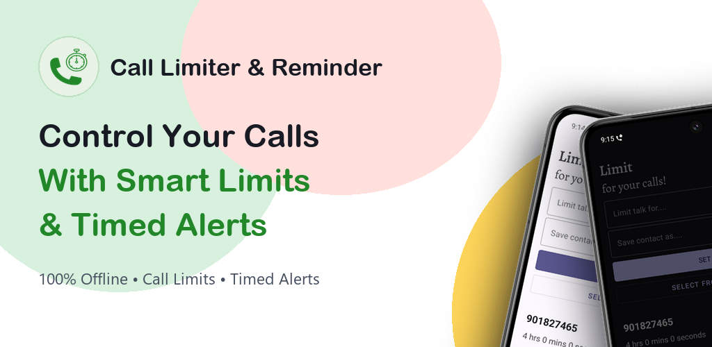
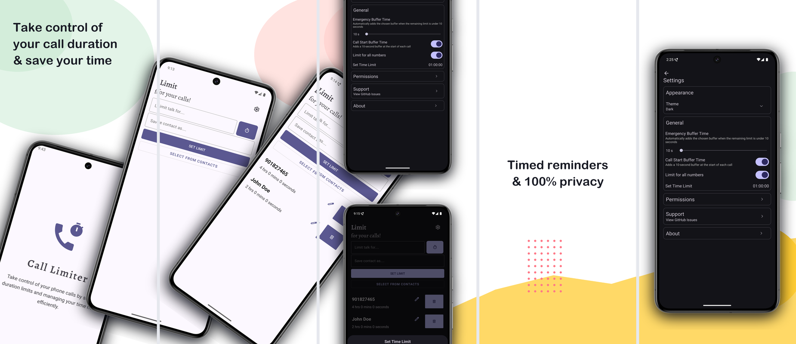

# Call Limiter & Reminder

**Call Limiter & Reminder** is a modern, 100% Kotlin Android application designed to help you take full control of your phone calls by setting duration limits, periodic audio & vibration reminders, and managing your screen time on phone calls efficiently.

  

---

## 📱 Screenshots

  

---

## 🌟 Key Features

- ⏱️ **Set Precise Time Limits** – Define limits in hours, minutes, and **seconds** for specific contacts or globally for all calls.
- 🔔 **Independent Call Time Reminders** – Get multi-stage audio tones and gentle vibration alerts (e.g. at 15s, 30s, 60s...) during calls, with or without automatic call disconnect.
- 📴 **Smart Auto-Disconnect** – Automatically ends the call once the set limit is reached.
- 🎨 **Rich Appearance & Themes** – Modern UI supporting System Default, Light, Dark, and true **Dark (OLED)** modes.
- ⚡ **Emergency & Call Start Buffers** – Configurable buffer times for critical calls and flexible call start delay.
- 🔒 **100% Privacy & Offline** – No internet access, 0 tracking, 0 telemetry, 0 ads. All data remains exclusively on your device.
- 🚀 **100% Idiomatic Kotlin** – Built natively for performance, reliability, and modern Android standards.

## ⚒ How It Works

1. **Enter a Phone Number**: Manually enter a number or select directly from your contacts.
2. **Set a Time Limit**: Choose hours, minutes, and seconds using the smooth bottom sheet timer.
3. **Configure Reminders**: Choose your preferred audio and vibration reminder intervals in Settings.
4. **Automated Monitoring**: The background service tracks your call and alerts or disconnects according to your rules.

## 🔐 Permissions Used

- **READ_PHONE_STATE** → Detect ongoing calls and call states.
- **READ_CALL_LOG** → Identify call duration and manage limits.
- **CALL_PHONE** & **ANSWER_PHONE_CALLS** → End calls programmatically when limits expire.
- **POST_NOTIFICATIONS** → In-call elapsed duration and cancellation controls.
- **FOREGROUND_SERVICE** → Ensure accurate timing in the background.
- **VIBRATE** → Provide gentle haptic feedback for reminder alerts.

> ✅ All permissions are strictly required for local call management.  
> ✅ The application contains **zero internet permissions** and functions completely offline.

## 👤 Author & Maintainer

- **Mohamed Amine Louati**
  - GitHub: [@mohamedaminelouati](https://github.com/mohamedaminelouati)
  - LinkedIn: [Mohamed Amine Louati](https://www.linkedin.com/in/mohamed-amine-louati-a383a367)

## 📜 License & Acknowledgments

This project is licensed under the **GNU General Public License v3.0 (GPLv3)**.  
It is an enhanced and migrated fork based on the original open-source project *CallLimiter* by [Thiru-Malai](https://github.com/Thiru-Malai/CallLimiter).
